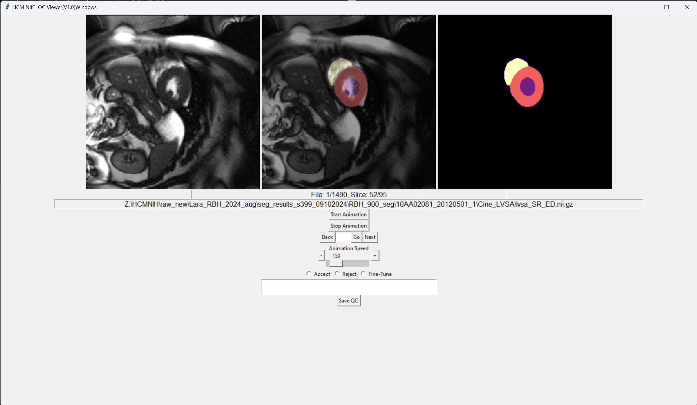

# HCM NIfTI QC Viewer

## Overview
HCM NIfTI QC Viewer is a Python-based application designed for visualizing and performing quality control on NIfTI (.nii.gz) files. The application provides functionalities to animate slices, load different files, and save quality control comments.


## How to Use
To use the .exe version, simply find the main.exe under dist folder. Make sure you have a QC_logs.json stored at the same level as main.exe.
We have uploaded a example QC_logs.json in the repo, please use your own way to build your QC_logs.

## Features
- Load and visualize NIfTI (.nii.gz) files.
- Animate slices of the loaded files.
- Navigate between different files.
- Save quality control comments.
- Display colorful segmentation maps.
- Automatically find Cardiac Drive.

## Requirements
- Python 3.7
- nibabel
- numpy
- tkinter
- PIL (Pillow)
- skimage
- matplotlib
- psutil
- json
- platform

## Clone the Repo to Local
1. Clone the repository:
   ```sh
   git clone https://github.com/yourusername/HCMQC.git
   cd HCMQC

--- Known Issues ---
1. Click 'Next' or 'Back' button, will double the play speed. Click Stop Animation will solve the issue

--- Pyinstaller CMDs ---
1. pyinstaller -F .\main.py
